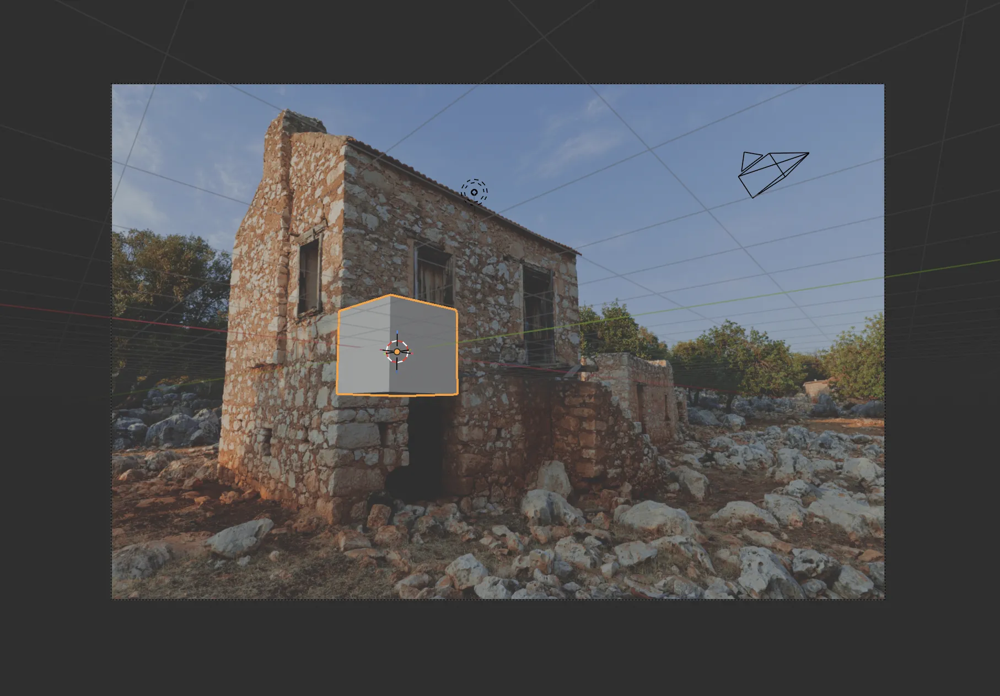
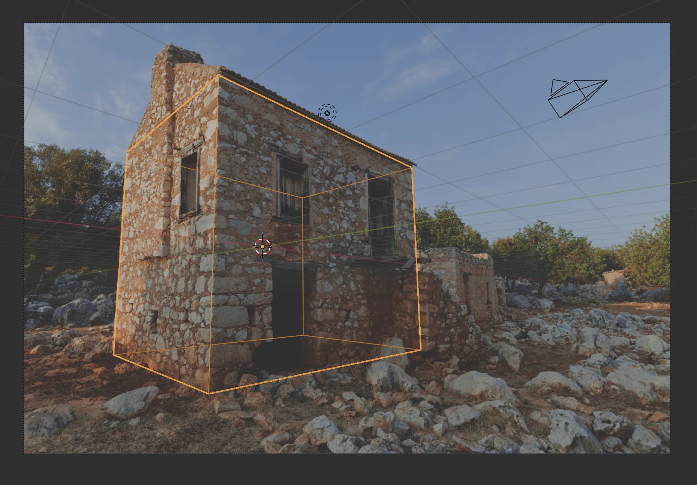
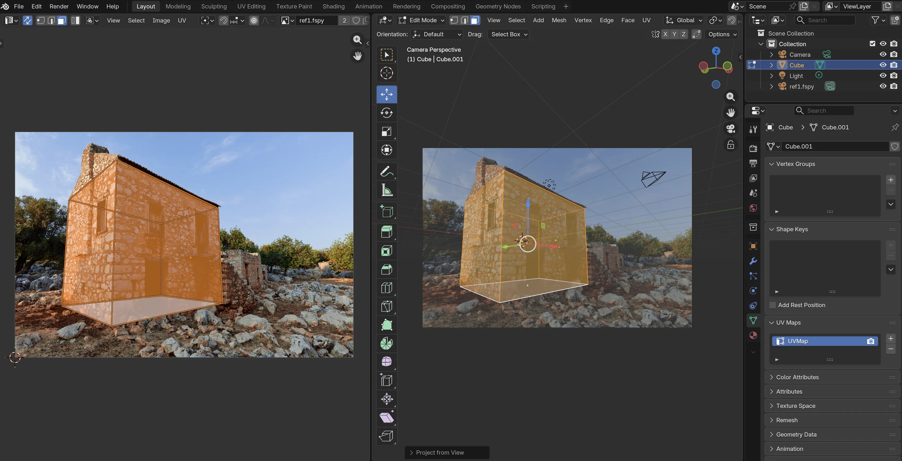
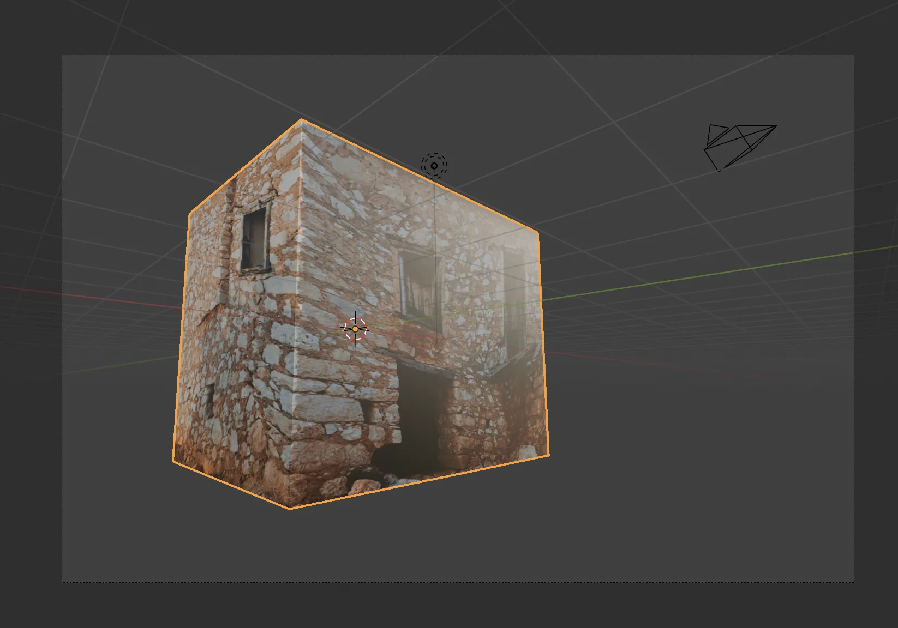
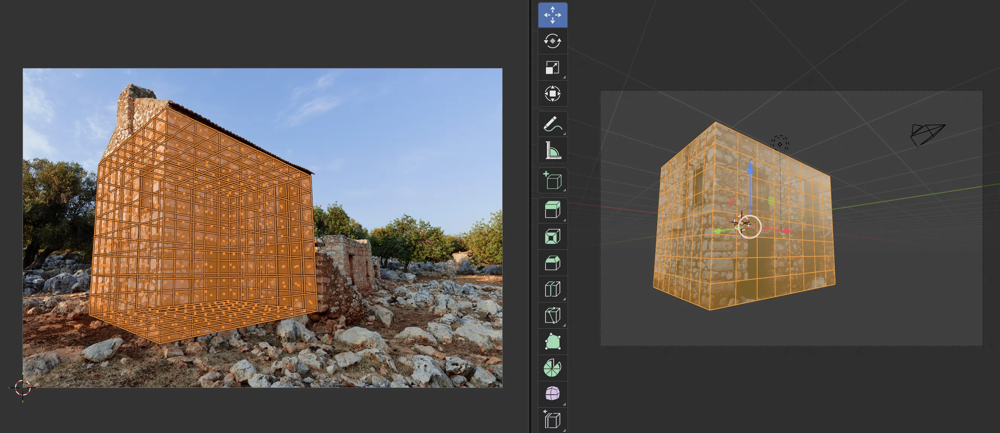
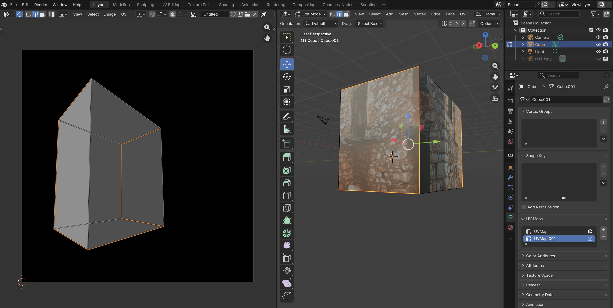
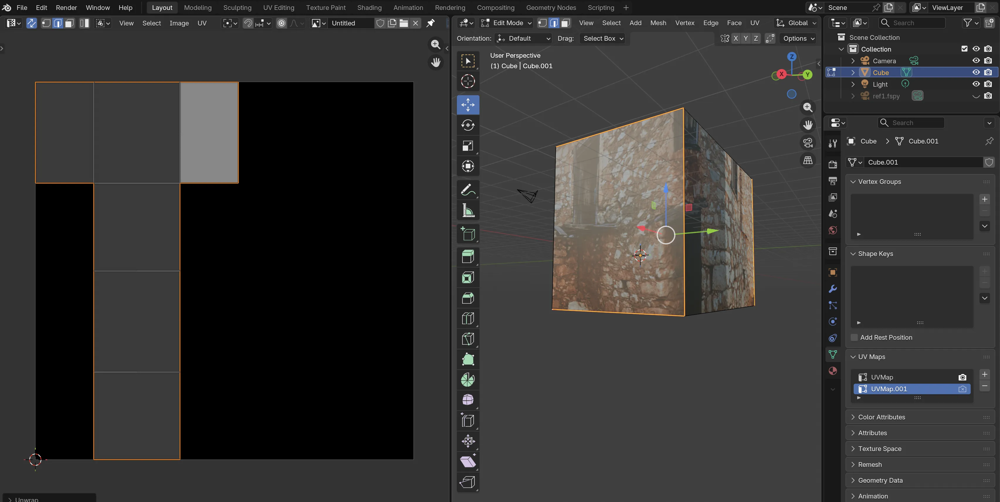
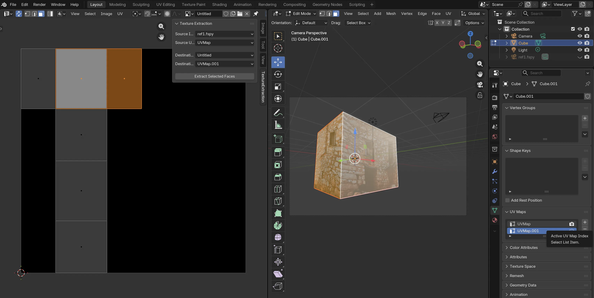
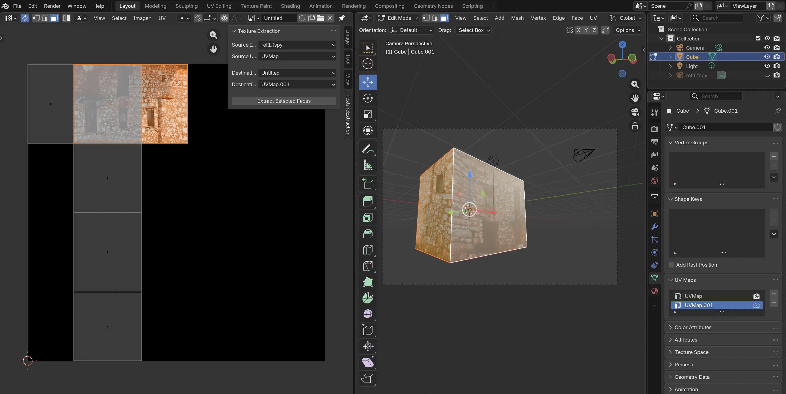
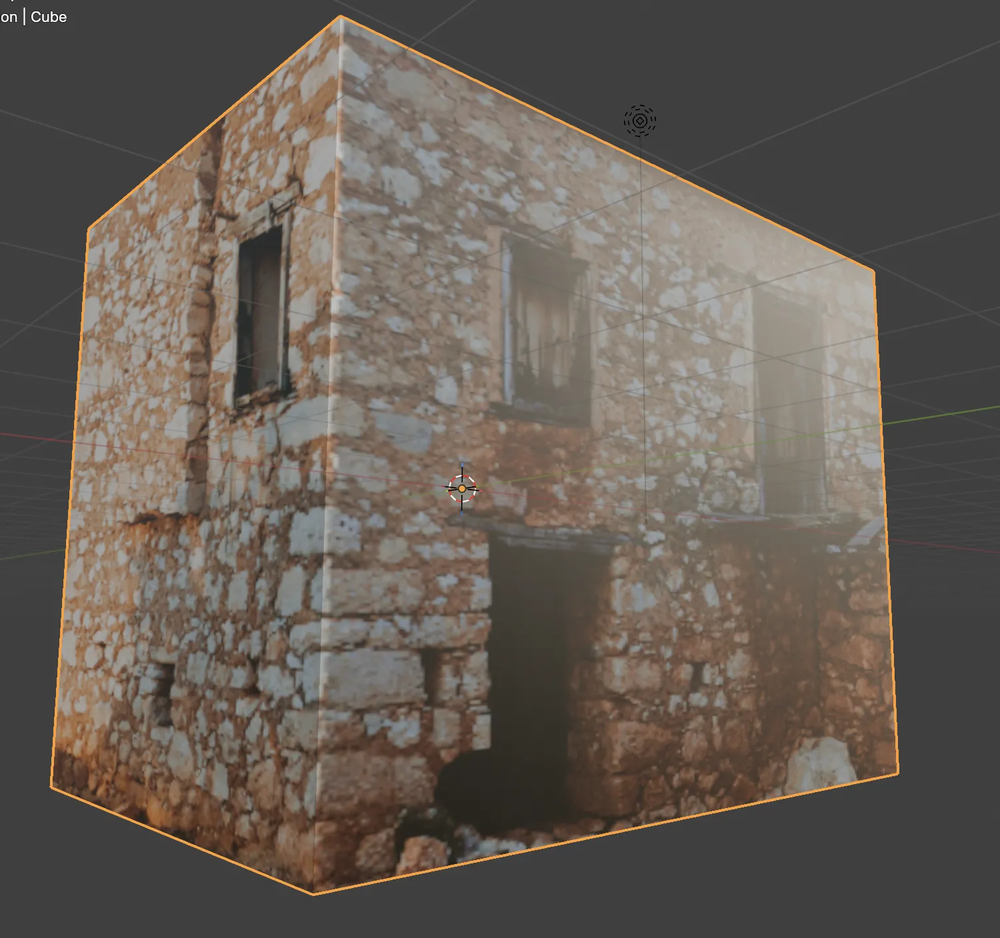

# UVRectifier

A Blender add-on that detects perspective-distorted (trapezoidal) texture regions and rectifies them into planar, rectangular textures for accurate mapping onto 3D geometry.

## Use case

If you are modeling with a reference image and want to extract textures from that same image, there are two common approaches:

- Subdivide your model to reduce warping caused by perspective distortion in the reference texture.
- Bake the camera view onto the mesh.

Below we demonstrate the first approach.

### Subdivide the model to reduce warping

We start with an fSpy file that contains the camera calibration and reference image. With the camera parameters known, align your geometry to the image.

Here is a rectangular mesh aligned to the reference image. I did not carefully select the principal point in fSpy, which is why the reference image is not aligned to the global origin. If you plan to use multiple fSpy files, choose a common principal point for consistent alignment.

Next, let's try to grab textures from the reference image. For this we need a UV map.

Go to `Material Properties` and create a new material for the selected object. Add an `Image Texture` node and connect it to the material's `Base Color`.

Choose the fSpy reference image from the image dropdown (the imported fSpy file already includes the reference image, so you do not need to import it separately).

Open `Object Data Properties` and look under the `UV Maps` section to see the UV maps associated with the selected object. Initially you will have a single UV map.

Switch to `Edit Mode`. Open another editor and choose `UV Editor` from the editor type menu.

In `Edit Mode`, ensure the 3D view is using the camera calibrated by fSpy. Select all vertices and press `U`, then choose `Project From View`. The UV editor will now show the vertices mapped to the correct positions.

Because the UV coordinates are aligned to the reference, you can render with the texture. Here is what happens when the cube is rendered with the texture applied.

What is happening? UVs do not contain depth information. For a rectangular face, Blender interpolates the underlying texture region linearly and assumes the sampled region is rectangular. In our case the sampled region is a trapezoid (a perspective-distorted rectangle). Linear interpolation across the face's fragments causes the texture to appear warped.

One solution is to add geometry by subdividing the cube. Add a Subdivision modifier, apply it, and re-project the UVs using `Project From View`. The diagonal distortions are reduced, but this has two drawbacks: it introduces unnecessary geometry, and interpolation inside each subdivided face can still be incorrect. The result is only corrected at face boundaries.

We want to avoid additional geometry and eliminate distortion. Instead of subdividing, we convert each trapezoidal texture region into a rectangular texture region. By defining rectangular faces in geometry, we know their corresponding trapezoidal regions in the texture should map to rectangles.

This small add-on automates that conversion.

Undo the subdivision to return to the original mesh.

In `Object Data Properties`, add a second UV map to the object.

Switch to `Edit Mode`. Select edges to define seams, right-click and choose `Mark Seam`.

Open the UV Editor and create a new texture image.

Now unwrap the UV coordinates onto the new texture image: in the UV Editor, right-click and choose `Unwrap`.

You can adjust the size, but do not distort the rectangles. In future versions of this add-on, regions will be optimized based on source pixel density; for now this step is manual.

Next, use the add-on to copy trapezoidal regions from the reference image and correct them. The add-on exposes four fields:

- Source Image: the fSpy reference image
- Source UV: the UV map calculated by `Project From View`
- Destination Image: the new texture image
- Destination UV: the UV map of rectangular regions on the new image

Select the faces you want to extract and press `Extract Selected Faces`.

The trapezoids are corrected and pasted onto the new texture image. Repeat this process for other reference images or faces, pasting them into the same texture as needed.

Select the second UV map from `Object Data Properties` and set the new texture image as the material's source texture. The final result is simple geometry with no distortion. (Don't forget to save the new texture image.)

## To do

- Optimize region packing and texture resolution.

